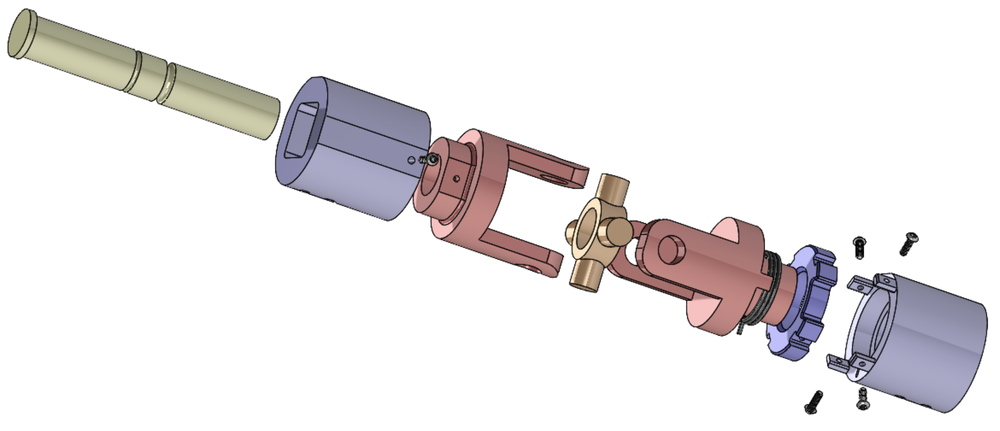
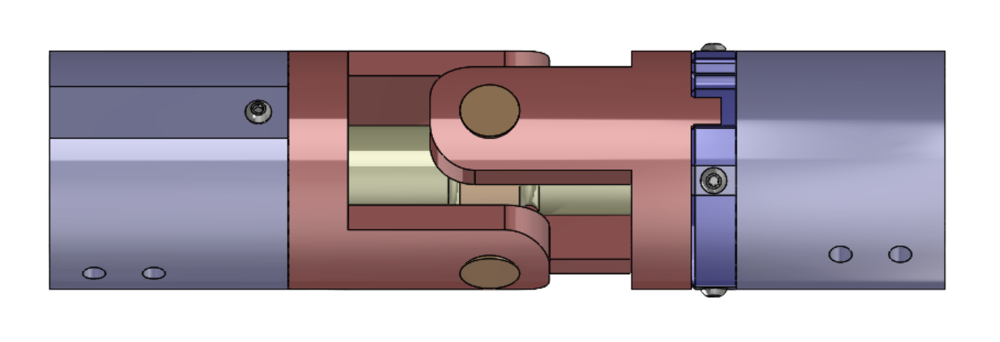
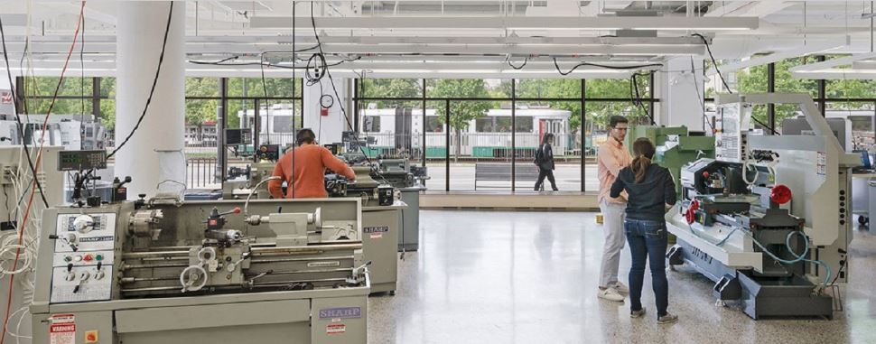
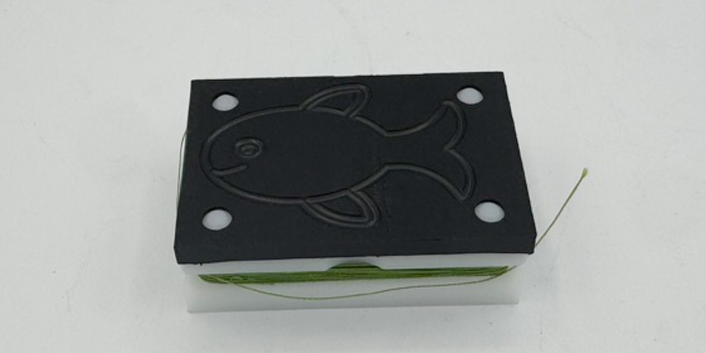
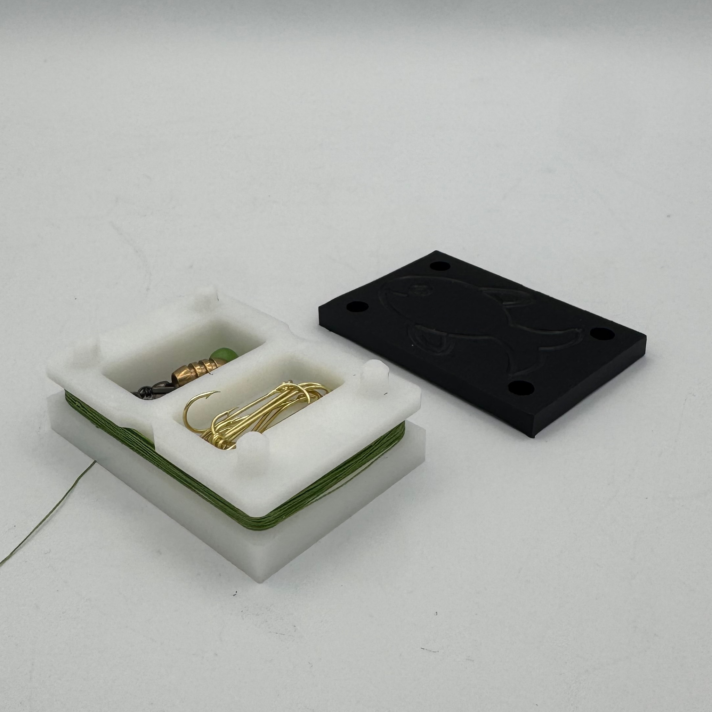

<!-- TOPBAR -->

  

    <a class="brand" href="./">Erik Hogset</a>
    Mechanical Engineering • Boston University
  

  

    <a class="toplink" href="projects.md">Projects</a>
    <a class="toplink" href="coursework.md">Academic Focus</a>
    <a class="toplink" href="about.md">About</a>
    <a class="toplink" href="resume.pdf">Resume</a>
  

<!-- HERO -->

  

    <h1>I’m Erik.</h1>

    
Manufacturing &amp; Automation • Mechanical Design • Clean Energy Systems

    

      I design and build mechanical systems that are manufacturable, testable, and grounded in real-world constraints.
      Experience includes electromechanical prototyping, automation, and hands-on fabrication, with growing interests in clean energy.
    

    
Quick skills

    

      CNC + CAM
      SolidWorks / Fusion
      MATLAB / Python
      Prototyping
    

    

      <a class="btn btn-primary" href="projects.md">View Projects</a>
      <a class="btn btn-ghost" href="resume.pdf">Resume</a>
      <a class="btn btn-ghost" href="coursework.md">Academic Focus</a>
      <a class="btn btn-ghost" href="about.md">About</a>
    

    

      <a href="mailto:erikh@bu.edu">erikh@bu.edu</a>
      &nbsp;•&nbsp;
      <a href="https://linkedin.com/in/erikhogset">LinkedIn</a>
    

  

  

    
  

<!-- FEATURED -->

  <h2>Featured</h2>

  <!-- Road Sign (CAD hover swap; contained, small) -->
  

    
Reactive Road Sign System

    

      Senior Design capstone addressing extreme wind loads and deployable retrofit concepts.
    

    <a class="read-more" href="road-sign-system.md">Read more →</a>

    
  

  <!-- EPIC (photo; SMALL, like before) -->
  

    

      
Engineering Product Innovation Center (EPIC)

      

        Laboratory Assistant supporting student and faculty engineering projects through CNC machining,
        additive manufacturing (FFF &amp; SLA), CAD-to-CAM workflows, and hands-on prototyping in a high-traffic makerspace.
      

      <a class="read-more" href="about.md">Learn more →</a>
    

    
  

  <!-- ADML (photo hover swap; MEDIUM) -->
  

    

      
Automated Design &amp; Manufacturing Lab (ADML)

      

        CAD-to-CAM + CNC prototyping in BU’s ADML, focused on manufacturable design and iterative testing.
      

      <a class="read-more" href="adml.md">Read more →</a>
    

    
  

